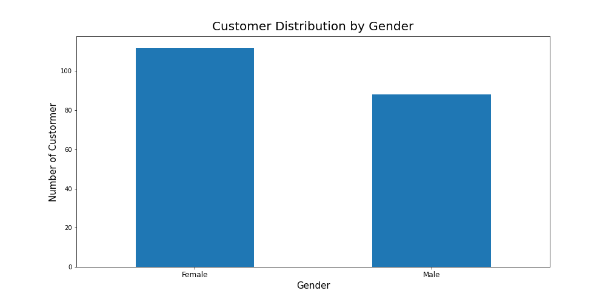
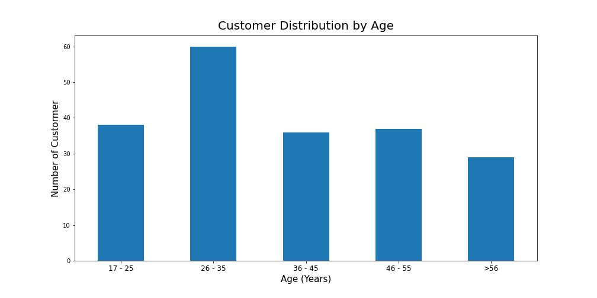
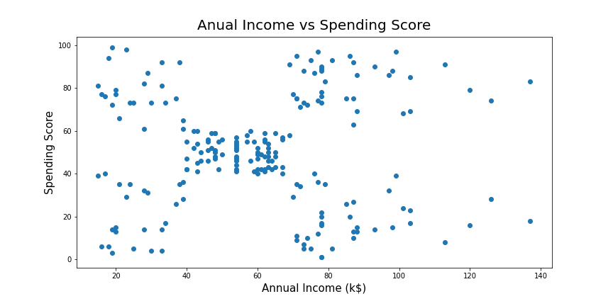
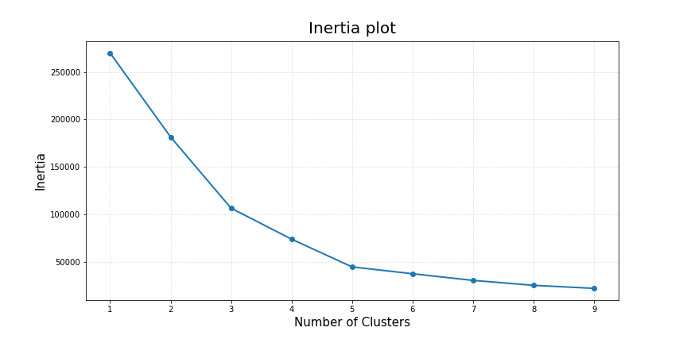
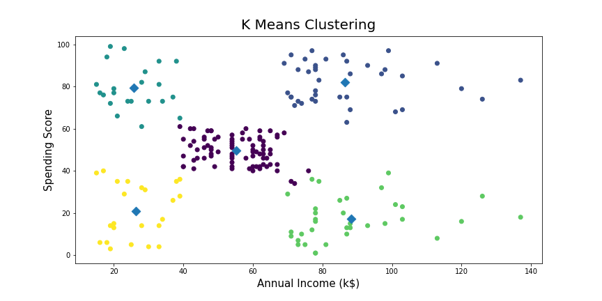

# Customer Segmentation using K-Means Algorithm 

Project ini menggunakan [Mall Customer Segmentation Data](https://www.kaggle.com/vjchoudhary7/customer-segmentation-tutorial-in-python), dataset ini memiliki 5 kolom:
* CustomerID
* Gender
* Age
* Annual Income (k$)
* Spending Score (1-100)

## Customer Distribution by Gender

  
## Customer Distribution by Age

## Plot Anual Income vs Spending Score

## Implemented K-Means Algorithm to do Customer Segmentation using Annual Income (k$) & Spending Score (1-100)
### Measuring Cluster Criteria

###  K-Means Clustering Model using K=5

