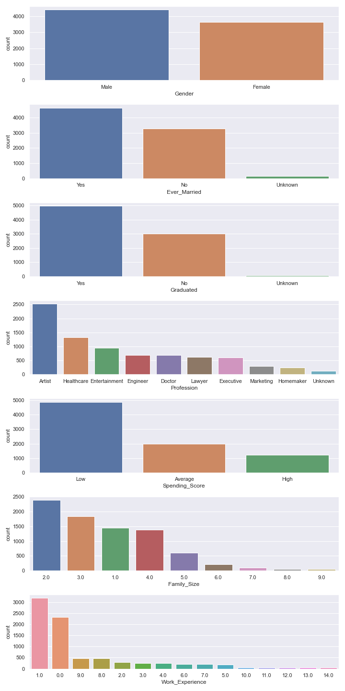

# Customer Segmentation using K-Means Algorithm 

Project ini menggunakan data customer dari [automobile company](https://www.kaggle.com/vetrirah/customer) yang berencana memasuki pasar baru dengan menggunakn produk mereka yang telah ada. Pada project ini akan dilakukan customer segmentation untuk mengidentifikasi customer baru yang potensial.

## Data Cleansing
Langkah-langkah yang akan dilakukan adalah:
- Mengatasi data-data yang memiliki *missing values* dengan metode *imputation*
- Mengatasi outlier atau pencilan dengan menggunakan metode *interquartile range* (IQR)

## Exploratory Data Analysis
### Numerical Columns

  
### Categorical Columns

## Data PreProcessing
- Menghapus columns yang tidak dibutuhkan dalam pembuatan model
- Melakukan *decimal scaling* untuk kolom numerik
- Melakukan encoding data untuk kolom kategorik

## Implemented K-Prototypes Algorithm to do Customer Segmentation
### Measuring Cluster Criteria

###  Identify Segment for Each Customer

## Conclusion
Berdasarkan pemodelan yang telah dilakukan dengan menggunakan metode algoritma K-Prototypes diperoleh 5 cluster customer, yaitu:
- Cluster 0: isi cluster ini didominasi oleh para **pekerja seni** yang telah **menikah** dan yang memiliki **spending score average**.
- Cluster 1: isi cluster ini didominasi oleh para **pekerja dibidang hukum** yang  memiliki umur diatas **60 tahun** dan telah menikah dengan **spending score high**.
- Cluster 2: isi cluster ini didominasi oleh para **pelajar dan mahasiswa** yang **belum menikah** dengan **spending score low**
- Cluster 3: isi cluster ini didominasi oleh customer yang **belum menikah** dengan **spending score low**
- Cluster 4: isi cluster ini didominasi oleh customer yang **sudah menikah** dengan **spending score average**
